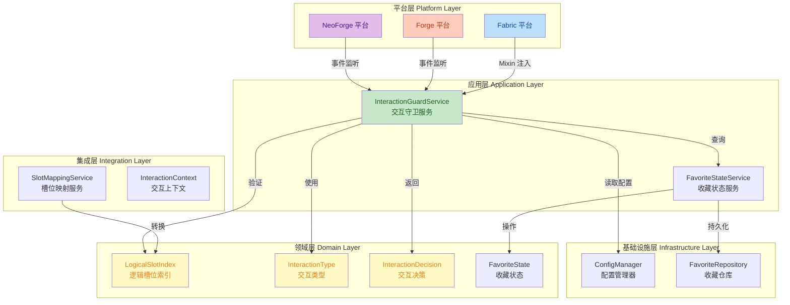
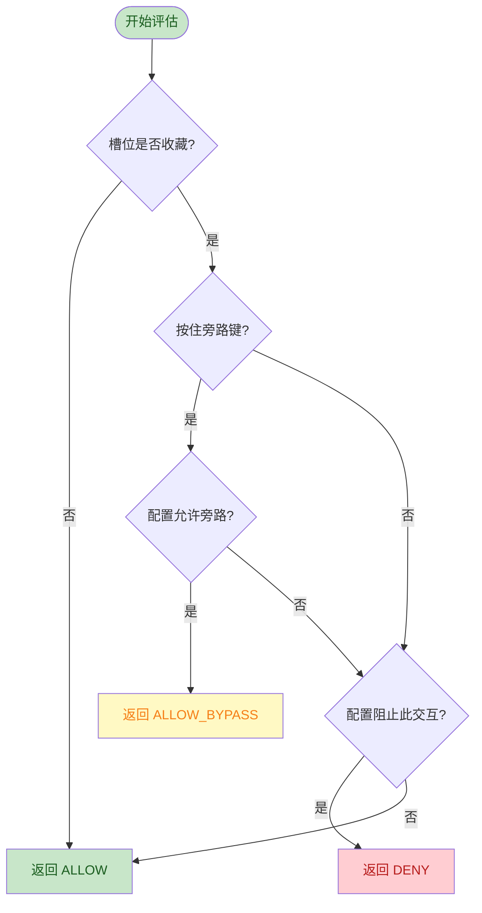

## 1. 高层摘要 (TL;DR)

**影响范围：** 🟡 **高** - 重大架构重构，涉及核心数据模型、构建系统和平台集成层

**关键变更：**

- 🏗️ **构建系统现代化**：从 Groovy DSL 迁移到 Kotlin DSL，统一使用 Architectury Loom 多平台构建
- 📐 **架构分层重构**：引入五层架构（Domain、Application、Infrastructure、Integration、Platform），新增领域模型和服务层
- 🎯 **槽位模型统一**：引入 `LogicalSlotIndex` 值对象，统一玩家物品栏槽位模型（0-40）
- 🛡️ **交互拦截服务化**：新增 `InteractionGuardService` 集中处理交互决策，Fabric 平台已接入 Mixin 拦截
- 🔄 **API 升级**：Fabric/Forge/NeoForge 平台迁移到 1.21.1 Mojmap API

---

## 2. 可视化概览 (代码与逻辑图)



**架构分层说明：**

| 层级                            | 职责                       | 关键组件                                                     |
| ------------------------------- | -------------------------- | ------------------------------------------------------------ |
| **Domain (领域层)**             | 纯业务模型和规则           | `LogicalSlotIndex`, `InteractionType`, `InteractionDecision` |
| **Application (应用层)**        | 用例导向的服务协调         | `InteractionGuardService`, `FavoriteStateService`            |
| **Integration (集成层)**        | Minecraft 特定但加载器中立 | `SlotMappingService`, `InteractionContext`                   |
| **Infrastructure (基础设施层)** | 持久化、配置、网络         | `ConfigManager`, `FavoriteRepository`                        |
| **Platform (平台层)**           | 加载器特定注册和引导       | Fabric/Forge/NeoForge 入口                                   |

---

## 3. 详细变更分析

### 3.1 构建系统现代化

#### 3.1.1 Gradle DSL 迁移

**变更内容：**
- 新增根目录 `build.gradle.kts` 和 `settings.gradle.kts`
- 各子模块（common/fabric/forge/neoforge）新增对应的 `.kts` 构建文件
- 统一使用 Architectury Loom 1.13.469 和 Architectury Plugin 3.4.162

**关键配置：**

| 配置项        | 旧值             | 新值               | 说明                   |
| ------------- | ---------------- | ------------------ | ---------------------- |
| 构建脚本      | `build.gradle`   | `build.gradle.kts` | Kotlin DSL 替代 Groovy |
| Loom 版本     | -                | `1.13.469`         | 统一多平台构建工具     |
| Java 版本     | -                | `21`               | 源码和目标兼容性       |
| Fabric API    | `0.100.1+1.21.1` | `0.116.10+1.21.1`  | 版本升级               |
| Forge 版本    | `52.0.20`        | `52.1.14`          | 版本升级               |
| NeoForge 版本 | `21.0.14-beta`   | `21.1.224`         | 版本升级               |

**依赖仓库配置：**
```kotlin
repositories {
    mavenCentral()
    maven("https://maven.architectury.dev/")
    maven("https://maven.fabricmc.net/")
    maven("https://maven.minecraftforge.net/")
    maven("https://maven.neoforged.net/releases/")
}
```

#### 3.1.2 `.gitignore` 更新

新增 Gradle 构建产物忽略规则：
```
.gradle/
.gradle-home/
.gradle-home-2/
build/
**/build/
```

---

### 3.2 领域层新增

#### 3.2.1 `LogicalSlotIndex` - 逻辑槽位索引

**文件：** `common/src/main/java/mycraft/yuyears/newitemfavorites/domain/LogicalSlotIndex.java`

**设计目标：** 统一玩家物品栏槽位模型，避免使用原始 `int` 类型

**槽位范围定义：**

| 槽位类型 | 索引范围 | 说明                   |
| -------- | -------- | ---------------------- |
| 热键栏   | `0-8`    | 快捷键槽位             |
| 主物品栏 | `9-35`   | 常规物品槽             |
| 盔甲栏   | `36-39`  | 头盔、胸甲、护腿、靴子 |
| 副手     | `40`     | 左手槽位               |

**核心方法：**
```java
public final class LogicalSlotIndex {
    public static final int MIN_INDEX = 0;
    public static final int MAX_INDEX = 40;
    
    public static LogicalSlotIndex of(int value)  // 工厂方法，带验证
    public static boolean isValid(int value)       // 静态验证方法
    public int value()                              // 获取原始值
    
    // 语义查询方法
    public boolean isHotbar()        // 0-8
    public boolean isMainInventory()  // 9-35
    public boolean isArmor()          // 36-39
    public boolean isOffhand()        // 40
}
```

#### 3.2.2 `InteractionType` - 交互类型枚举

**文件：** `common/src/main/java/mycraft/yuyears/newitemfavorites/domain/InteractionType.java`

**枚举值：**

| 枚举值               | 说明                   |
| -------------------- | ---------------------- |
| `CLICK`              | 点击拾取               |
| `DROP`               | 丢弃物品               |
| `QUICK_MOVE`         | 快速移动（Shift+点击） |
| `SHIFT_CLICK`        | Shift 点击             |
| `DRAG`               | 拖拽操作               |
| `SWAP`               | 交换槽位               |
| `USE_ITEM`           | 使用物品               |
| `PLACE_BLOCK`        | 放置方块               |
| `CONSUME_ITEM`       | 消耗品使用             |
| `USE_TOOL_OR_WEAPON` | 工具/武器使用          |
| `UNKNOWN`            | 未知类型               |

#### 3.2.3 `InteractionDecision` - 交互决策记录类

**文件：** `common/src/main/java/mycraft/yuyears/newitemfavorites/domain/InteractionDecision.java`

**决策类型：**

| 工厂方法        | 说明           | `allowed` | `bypassed` |
| --------------- | -------------- | --------- | ---------- |
| `allow()`       | 允许交互       | `true`    | `false`    |
| `allowBypass()` | 通过旁路键允许 | `true`    | `true`     |
| `deny(reason)`  | 拒绝交互       | `false`   | `false`    |

---

### 3.3 应用层新增

#### 3.3.1 `InteractionGuardService` - 交互守卫服务

**文件：** `common/src/main/java/mycraft/yuyears/newitemfavorites/application/InteractionGuardService.java`

**职责：** 集中处理收藏槽位的交互拦截决策

**核心方法：**

```java
public InteractionDecision evaluate(int slot, InteractionType type, boolean holdingBypassKey)
public InteractionDecision evaluate(LogicalSlotIndex slot, InteractionType type, boolean holdingBypassKey)
```

**决策逻辑流程：**



**配置映射规则：**

| `InteractionType`                                            | 配置字段                                |
| ------------------------------------------------------------ | --------------------------------------- |
| `CLICK`                                                      | `config.lockBehavior.preventClick`      |
| `DROP`                                                       | `config.lockBehavior.preventDrop`       |
| `QUICK_MOVE`                                                 | `config.lockBehavior.preventQuickMove`  |
| `SHIFT_CLICK`                                                | `config.lockBehavior.preventShiftClick` |
| `DRAG`                                                       | `config.lockBehavior.preventDrag`       |
| `SWAP`                                                       | `config.lockBehavior.preventSwap`       |
| `USE_ITEM`, `PLACE_BLOCK`, `CONSUME_ITEM`, `USE_TOOL_OR_WEAPON` | **始终阻止**                            |
| `UNKNOWN`                                                    | **始终阻止**                            |

---

### 3.4 集成层新增

#### 3.4.1 `SlotMappingService` - 槽位映射服务

**文件：** `common/src/main/java/mycraft/yuyears/newitemfavorites/integration/SlotMappingService.java`

**职责：** 在原始槽位索引和 `LogicalSlotIndex` 之间转换

**核心方法：**

```java
public static Optional<LogicalSlotIndex> fromPlayerInventoryIndex(int inventoryIndex)
public static int toInt(Optional<LogicalSlotIndex> logicalSlotIndex)
public static boolean isPlayerInventoryIndex(int inventoryIndex)
```

**设计优势：**
- 使用 `Optional` 显式处理无效槽位
- 集中槽位验证逻辑
- 避免平台层直接依赖领域模型

---

### 3.5 核心类重构

#### 3.5.1 `FavoritesManager` 重构

**文件：** `common/src/main/java/mycraft/yuyears/newitemfavorites/FavoritesManager.java`

**关键变更：**

| 变更项       | 旧实现         | 新实现                           |
| ------------ | -------------- | -------------------------------- |
| 内部存储类型 | `Set<Integer>` | `Set<LogicalSlotIndex>`          |
| 槽位验证     | 无显式验证     | 通过 `SlotMappingService` 验证   |
| 交互决策     | 内联逻辑       | 委托给 `InteractionGuardService` |

**新增重载方法：**

```java
// 兼容旧 API，内部转换
public boolean isSlotFavorite(int slot)
public void toggleSlotFavorite(int slot)
public void setSlotFavorite(int slot, boolean favorite)

// 新 API，直接使用 LogicalSlotIndex
public boolean isSlotFavorite(LogicalSlotIndex slot)
public void toggleSlotFavorite(LogicalSlotIndex slot)
public void setSlotFavorite(LogicalSlotIndex slot, boolean favorite)
public Set<LogicalSlotIndex> getFavoriteLogicalSlots()
```

**序列化兼容性：**
```java
// 序列化时转换为 int
public byte[] serialize() {
    for (LogicalSlotIndex slot : favoriteSlots) {
        sb.append(slot.value()).append(",");
    }
}

// 反序列化时验证并转换
public void deserialize(byte[] data) {
    SlotMappingService.fromPlayerInventoryIndex(Integer.parseInt(slotStr))
        .ifPresent(favoriteSlots::add);
}
```

#### 3.5.2 `ConfigManager` 语法更新

**文件：** `common/src/main/java/mycraft/yuyears/newitemfavorites/ConfigManager.java`

**变更内容：** 更新 switch 表达式语法（Java 14+）

```java
// 旧语法（箭头转义）
case "general" -> setGeneralValue(key, value);  // 实际上是 -> 但被转义为 -&gt;

// 新语法（标准箭头）
case "general" -> setGeneralValue(key, value);
```

#### 3.5.3 `OverlayRenderer` 抽象化

**文件：** `common/src/main/java/mycraft/yuyears/newitemfavorites/render/OverlayRenderer.java`

**关键变更：**

| 变更项                      | 说明                                                     |
| --------------------------- | -------------------------------------------------------- |
| 移除 `MinecraftClient` 依赖 | 避免平台特定代码泄漏到 common 层                         |
| 图标路径改为常量字符串      | `LOCK_ICON_PATH` 等，由平台层解析为 `ResourceLocation`   |
| 方法签名更新                | 参数从 `int slotIndex` 改为 `LogicalSlotIndex slotIndex` |

---

### 3.6 Fabric 平台集成

#### 3.6.1 新增 Mixin 拦截

**文件：** `fabric/src/main/java/mycraft/yuyears/newitemfavorites/fabric/mixin/AbstractContainerScreenMixin.java`

**拦截目标：** `AbstractContainerScreen#slotClicked`

**拦截逻辑：**

```java
@Inject(method = "slotClicked", at = @At("HEAD"), cancellable = true)
private void newItemFavorites$guardFavoriteSlot(Slot slot, int slotId, int button, ClickType clickType, CallbackInfo ci) {
    if (slot == null || !isPlayerInventorySlot(slot)) {
        return;
    }
    
    var decision = InteractionGuardService.getInstance().evaluate(
        slot.getContainerSlot(),
        toInteractionType(clickType),
        NewItemFavoritesFabric.isBypassKeyHeld()
    );
    
    if (decision.denied()) {
        ci.cancel();  // 取消点击事件
    }
}
```

**ClickType 映射：**

| `ClickType`            | `InteractionType` |
| ---------------------- | ----------------- |
| `PICKUP`, `PICKUP_ALL` | `CLICK`           |
| `QUICK_MOVE`           | `QUICK_MOVE`      |
| `SWAP`                 | `SWAP`            |
| `THROW`                | `DROP`            |
| `QUICK_CRAFT`          | `DRAG`            |
| `CLONE`                | `UNKNOWN`         |

#### 3.6.2 `FabricOverlayRenderer` API 升级

**文件：** `fabric/src/main/java/mycraft/yuyears/newitemfavorites/fabric/render/FabricOverlayRenderer.java`

**API 迁移：**

| 旧 API (1.20.x)            | 新 API (1.21.1)                           |
| -------------------------- | ----------------------------------------- |
| `DrawContext`              | `GuiGraphics`                             |
| `HandledScreen`            | `AbstractContainerScreen`                 |
| `context.drawTexture()`    | `context.blit()`                          |
| `context.setShaderColor()` | `RenderSystem.setShaderColor()`           |
| `Identifier`               | `ResourceLocation.fromNamespaceAndPath()` |

**反射兼容层：**

```java
// 获取槽位索引（兼容不同映射版本）
private int getContainerSlotIndex(Slot slot) {
    Integer methodResult = invokeIntMethod(slot, "getContainerSlot");
    if (methodResult != null) return methodResult;
    
    Integer fieldResult = readIntField(slot, "slot");
    if (fieldResult != null) return fieldResult;
    
    fieldResult = readIntField(slot, "index");
    return fieldResult == null ? -1 : fieldResult;
}

// 获取屏幕偏移（兼容私有字段访问）
private int getScreenLeft(AbstractContainerScreen<?> screen) {
    Integer value = readIntField(screen, "leftPos");
    return value == null ? 0 : value;
}
```

---

### 3.7 文档更新

#### 3.7.1 `ARCHITECTURE_DESIGN.md` 新增

**内容概要：** 583 行架构设计文档，定义了完整的分层架构和迁移计划

**核心章节：**

1. **设计原则**（6 条）
   - 领域优先
   - 薄 Mixin 和事件钩子
   - 服务端权威，客户端响应
   - 稳定的逻辑槽位模型
   - 显式上下文
   - 渐进式能力

2. **五层架构定义**
   - A. Domain Layer（领域层）
   - B. Application Layer（应用层）
   - C. Infrastructure Layer（基础设施层）
   - D. Platform-Common Integration Layer（平台通用集成层）
   - E. Platform Loader Layer（平台加载器层）

3. **迁移计划**（5 个阶段）
   - Phase 1: 架构基础
   - Phase 2: 替换状态核心
   - Phase 3: Fabric 优先交互拦截
   - Phase 4: 同步和权威
   - Phase 5: Forge/NeoForge 对等

#### 3.7.2 `TODO.md` 重构

**变更内容：** 从任务列表重构为分阶段开发计划

| 阶段                                   | 状态     | 说明                       |
| -------------------------------------- | -------- | -------------------------- |
| 阶段 0：本地构建入口                   | ✅ 完成   | 固定 Gradle 路径和缓存目录 |
| 阶段 1：架构设计与 common 核心         | ✅ 完成   | 引入领域模型和服务层       |
| 阶段 2：Fabric 1.21.1 基础集成         | ✅ 完成   | Mojmap/API 迁移            |
| 阶段 3：Forge/NeoForge 1.21.1 基础集成 | ✅ 完成   | 平台层 helper 隔离         |
| 阶段 4：交互拦截与服务端权威           | 🔄 进行中 | Fabric Mixin 已接入        |
| 阶段 5：资源、体验与测试               | ⏳ 待开始 | 纹理资源和单元测试         |

---

## 4. 影响与风险评估

### 4.1 破坏性变更

| 变更类型                        | 影响范围   | 兼容性处理                        |
| ------------------------------- | ---------- | --------------------------------- |
| `FavoritesManager` 内部存储类型 | 所有调用方 | 保留 `int` 重载方法，内部自动转换 |
| `OverlayRenderer` 方法签名      | 平台渲染器 | 平台层已适配新签名                |
| 构建系统                        | 所有模块   | 新旧构建文件共存，需清理旧文件    |

### 4.2 潜在风险

⚠️ **高风险项：**

1. **序列化兼容性**
   - **风险：** 旧版本保存的收藏数据可能无法正确加载
   - **缓解：** 反序列化时通过 `SlotMappingService` 验证，无效槽位自动丢弃

2. **反射访问稳定性**
   - **风险：** `FabricOverlayRenderer` 使用反射访问私有字段，可能因 Minecraft 更新而失效
   - **缓解：** 提供多字段名回退机制（`slot`/`index`，`leftPos`/`guiLeft`）

3. **Mixin 拦截完整性**
   - **风险：** 当前仅拦截 `slotClicked`，可能遗漏其他交互路径（如热键交换、物品使用）
   - **缓解：** 架构设计已预留扩展点，后续可补充更多 Mixin 目标

🟡 **中风险项：**

4. **平台层 API 差异**
   - **风险：** Forge/NeoForge 的交互拦截机制与 Fabric 不同，需要单独实现
   - **缓解：** `InteractionGuardService` 已平台无关，平台层只需适配事件钩子

5. **配置迁移**
   - **风险：** 旧版 TOML 配置可能需要更新
   - **缓解：** 配置结构未变更，仅 switch 语法更新

### 4.3 测试建议

✅ **必须测试的场景：**

1. **槽位收藏功能**
   - [ ] 切换收藏状态（热键栏、主物品栏、盔甲栏、副手）
   - [ ] 重启游戏后收藏状态持久化
   - [ ] 多个存档之间收藏状态隔离

2. **交互拦截功能**
   - [ ] 点击收藏槽位被阻止
   - [ ] Shift+点击收藏槽位被阻止
   - [ ] 拖拽收藏槽位被阻止
   - [ ] 按住旁路键时允许操作
   - [ ] 非收藏槽位正常操作

3. **渲染功能**
   - [ ] 收藏槽位显示正确图标
   - [ ] 按住旁路键时图标样式变化
   - [ ] 不同容器界面（背包、箱子、工作台）渲染一致

4. **边界情况**
   - [ ] 创造模式界面行为
   - [ ] 空收藏槽位自动解锁（如配置启用）
   - [ ] 无效槽位索引处理

5. **多平台兼容性**
   - [ ] Fabric 1.21.1 构建和运行
   - [ ] Forge 1.21.1 构建和运行
   - [ ] NeoForge 1.21.1 构建和运行

---

## 5. 总结

本次变更是一次**重大架构重构**，核心目标是提升代码的可维护性、可扩展性和多平台兼容性：

✨ **主要成就：**
- 🏗️ 建立了清晰的五层架构，分离关注点
- 🎯 引入领域驱动设计，使用值对象封装核心概念
- 🛡️ 实现了服务化的交互拦截逻辑，便于测试和扩展
- 🔄 统一了构建系统，使用现代 Kotlin DSL
- 📝 完善了架构设计文档和开发计划

🎯 **下一步行动：**
1. 补充 Forge/NeoForge 平台的交互拦截实现
2. 完善单元测试覆盖（特别是槽位映射和交互决策）
3. 添加更多 Mixin 拦截点（热键交换、物品使用等）
4. 实现服务端权威验证和网络同步
5. 补充纹理资源和本地化文件

---

**变更统计：**
- 新增文件：10 个（领域模型、应用服务、集成层、Mixin、构建配置）
- 修改文件：30 个（核心类、渲染器、平台入口、文档）
- 删除文件：0 个
- 代码行数：+~1500 行（含文档）